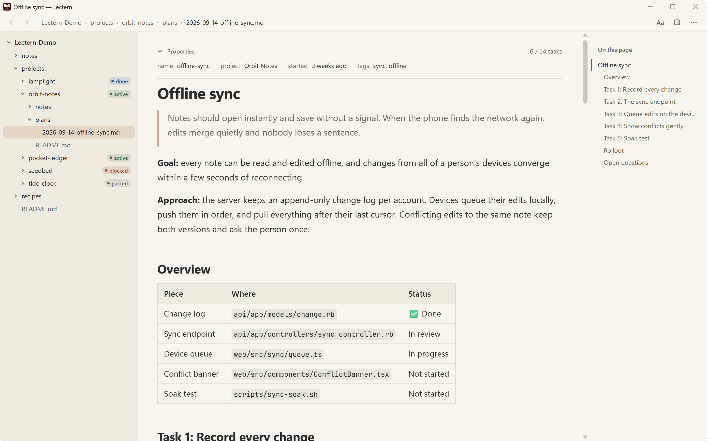
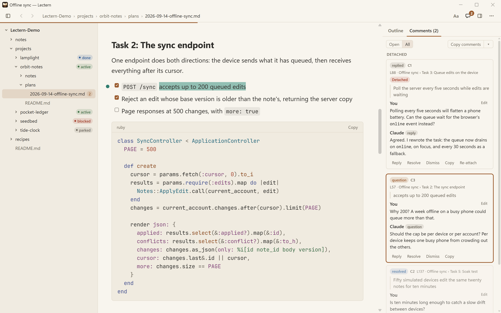
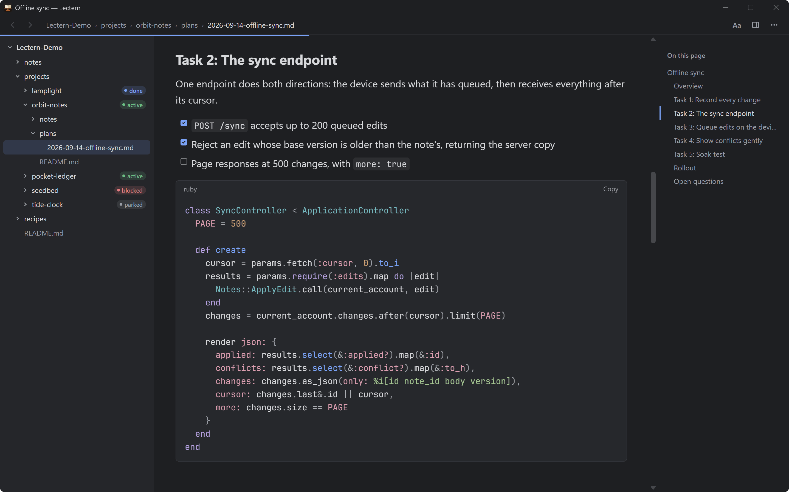
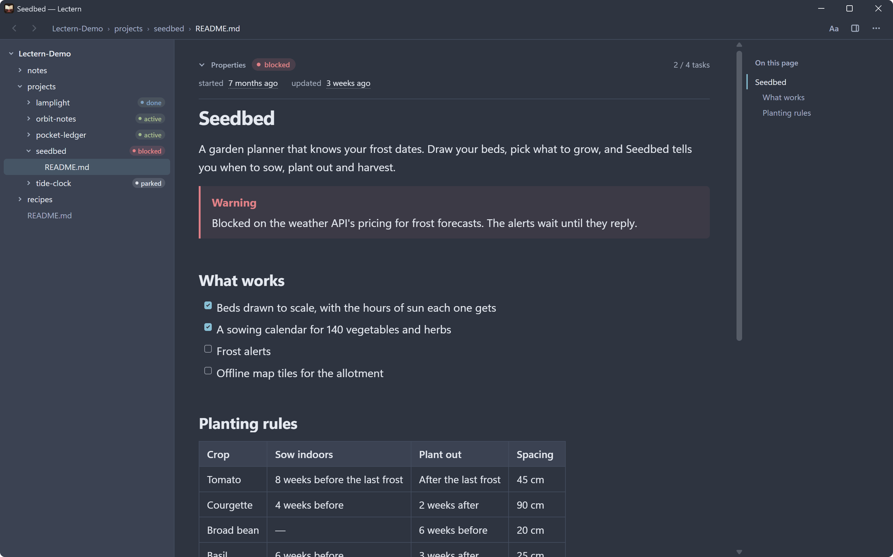
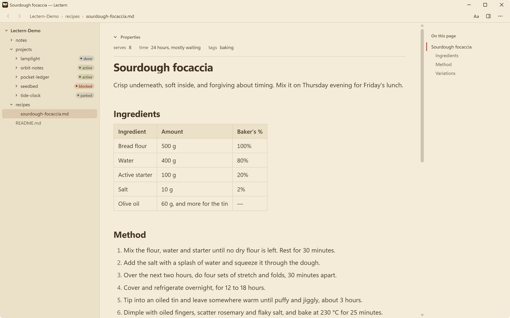
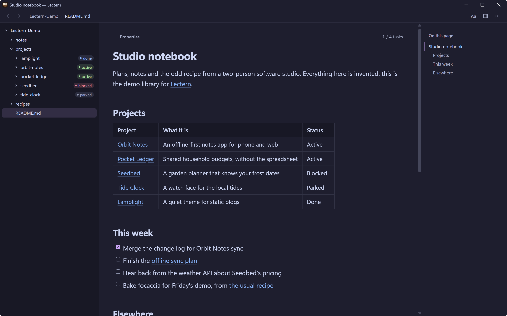
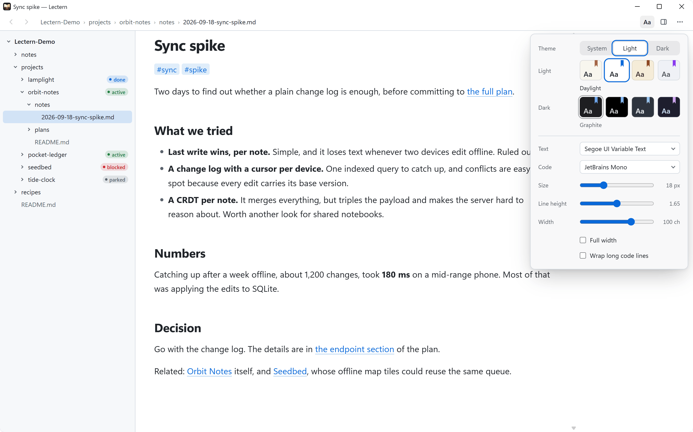
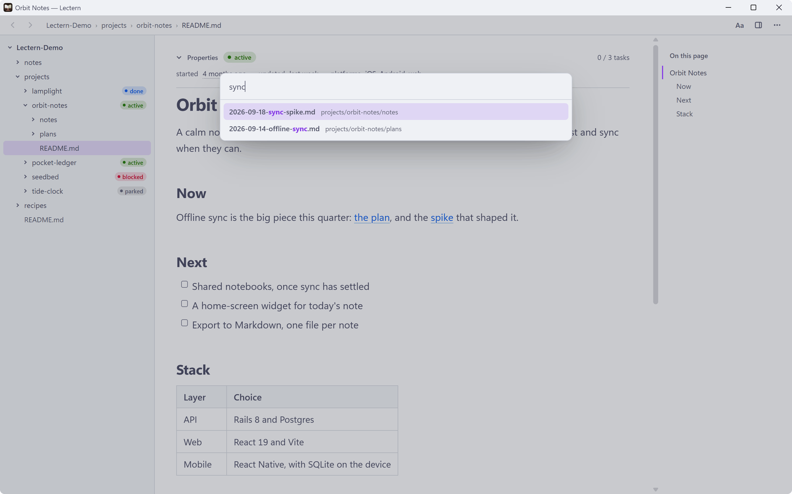
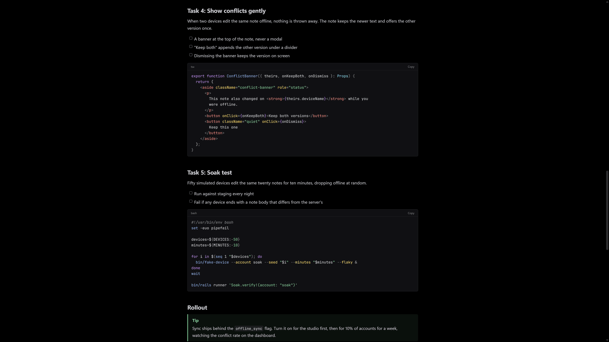

# Lectern

A fast, native Markdown reader for Windows, made for long documents and folders full of notes.

<p align="center">
  
</p>

<p align="center">
  <a href="https://github.com/tacticiankerala/lectern/releases/latest"><b>Download Lectern for Windows</b></a><br>
  <sub>Windows 10 (1809 or later) and Windows 11, x64. Free and open source.</sub>
</p>

Lectern opens your Markdown the way you meant it to look: tables that wrap, highlighted code, task lists, frontmatter and wikilinks that go somewhere. Point it at a folder of notes, or an Obsidian vault, and read. It never edits your notes.

## Features

- **Your notes as a library.** Add folders and browse them in the sidebar, or collapse it to give the page the room. Click any breadcrumb to pick a nearby file or folder from a list that goes away once you've chosen. A folder with a README shows that README's `status:` as a badge.
- **Faithful rendering.** GitHub-flavoured Markdown: tables, task lists, footnotes, alerts, raw HTML (made safe), and highlighted code. Frontmatter shows as a tidy properties strip, with a count of done tasks.
- **Links that work.** Obsidian-style wikilinks by file name, `name:` or path, with `#headings`. Relative links. File paths in your notes are clickable, including WSL and Linux paths, which Lectern maps to their Windows locations.
- **Find anything.** Quick open by name, search across the whole library, and find in the page.
- **Made for reading.** Eight themes, five bundled fonts or any font you have, and control over size, line height and width. An outline, a reading-progress line, and a focus mode.
- **Keeps your place.** Lectern remembers where you were in every document. When a file changes on disk it reloads in place, and back and forward work the way they do in a browser.
- **Quick.** A cold start straight into a 3,000-line document takes under half a second on a desktop PC.
- **Stays current.** Lectern checks GitHub Releases once a day and updates in one click.

## Reviewing with an AI agent

<p align="center">
  
</p>

You can comment on a note as you read it, then hand the comments to Claude, Codex or any other AI agent. A comment is a passage of the note, quoted, with your remark under it. Select some text and press the **Comment** button that appears, press **+** in the margin beside a paragraph, or press Ctrl+Alt+M. Comments show as highlights in the page and as cards in the right-hand panel's **Comments** tab.

Lectern saves them beside the note, in a plain Markdown file named after it: `plan.md` gets `plan.review.md`. The note itself is never changed.

**Copy comments**, in that tab, copies the open ones as text ready to paste into an agent, with the note's Windows and WSL paths. Or point the agent at the `.review.md` file. The agent answers by adding, at the end of a comment, a paragraph that starts with its own name and `reply`, `question`, `pushback` or `resolved`, such as `**Codex (question):**`, and the answer shows up in Lectern within a couple of seconds.

An agent can start a comment too, by adding one at the end of the file, and you reply in the same thread. An agent that creates the file from scratch must begin it with the frontmatter, or Lectern won't touch it:

```markdown
---
lectern-review: 1
note: plan.md
---
## C1 · open · L12 · Heading
> exact words from the note

**Codex (question):** …
```

When the note changes, each comment follows its text. One whose text was reworded is marked "text changed", and one whose text is gone is kept as **Detached** with its original quote, so no comment is ever lost.

The comments button beside **Aa** shows how many are open. Click it, or press Ctrl+Shift+M, to hide or show them. To turn comments off altogether, untick **Review comments** under **Reading** in Preferences.

## Gallery

<table>
  <tr>
    <td width="50%"><br><sub><b>Graphite</b>, on a plan's code</sub></td>
    <td width="50%"><br><sub><b>Nord</b>, with an alert and a task list</sub></td>
  </tr>
  <tr>
    <td width="50%"><br><sub><b>Sepia</b>, on a recipe</sub></td>
    <td width="50%"><br><sub><b>Catppuccin Mocha</b>, on a home page</sub></td>
  </tr>
  <tr>
    <td width="50%"><br><sub>The <b>Aa</b> reading panel, in Daylight</sub></td>
    <td width="50%"><br><sub><b>Quick open</b> (Ctrl+P), in Catppuccin Latte</sub></td>
  </tr>
  <tr>
    <td colspan="2" align="center"><br><sub><b>Focus mode</b> (F11), in Midnight</sub></td>
  </tr>
</table>

Every screenshot shows the invented demo library in [`fixtures/demo`](fixtures/demo). Add that folder to Lectern to try it yourself.

## Install

1. Download **`Lectern_…_x64-setup.exe`** from the [latest release](https://github.com/tacticiankerala/lectern/releases/latest) and run it. It installs Lectern for your account only, so it needs no admin rights, and it fetches Microsoft's WebView2 runtime if your PC doesn't have it yet.
2. Windows may show **"Windows protected your PC"**, because the installer isn't code-signed. Click **More info**, then **Run anyway**. Updates are different: Lectern checks each one against its own signing key before installing it.
3. Lectern installs to `%LOCALAPPDATA%\Lectern`. When a new version is out, a button appears in the toolbar to install it. To remove Lectern, use **Settings → Apps → Installed apps**.

**Portable.** Prefer not to install? Download **`Lectern_…_x64_portable.exe`** instead and run it from anywhere. It is the same app. It tells you when a new version is out, but leaves downloading it to you. It needs the WebView2 runtime, which Windows 11 already has.

**Make Lectern your Markdown reader.** The installer registers Lectern for `.md`, `.markdown`, `.mdown` and `.mkd` files, but Windows asks you before changing a default app. Right-click a `.md` file, choose **Open with → Choose another app**, pick **Lectern**, and select **Always**. You can also search for `.md` under **Settings → Apps → Default apps**. For the portable exe, choose **Choose an app on your PC** and browse to it.

## Status badges

Lectern reads the frontmatter of each folder's `README.md`. When it has a `status:`, the folder gets a badge in the library and the README's properties strip shows it too:

```markdown
---
status: active
---

# Orbit Notes
```

`active`, `blocked`, `parked` and `done` each have their own colour. Any other value shows as a plain badge. You can turn the badges off in Preferences.

## Keyboard shortcuts

| Keys | Action |
| --- | --- |
| Ctrl+O | Open a file |
| Ctrl+Shift+N | Add a folder to the library |
| Ctrl+P | Quick open |
| Ctrl+Shift+. | Open the breadcrumb chooser on the current file's folder |
| Ctrl+Shift+F | Search the library |
| Ctrl+F, then F3 / Shift+F3 | Find in the page, next and previous match |
| Alt+← / Alt+→ | Back and forward (the mouse's side buttons work too) |
| Ctrl+= / Ctrl+- / Ctrl+0 | Larger text, smaller text, default size |
| Ctrl+Alt+= / Ctrl+Alt+- / Ctrl+Alt+0 | Larger, smaller or default text in the library, outline and breadcrumb chooser |
| Ctrl+Shift+T | Switch between the light and dark theme |
| Ctrl+B | Show or hide the library |
| Ctrl+Shift+O | Show or hide the outline |
| Ctrl+Shift+M | Show or hide review comments |
| Ctrl+Alt+M | Comment on the selected text, or on the block at the top of the view |
| F11 | Focus mode |
| Ctrl+E | Open the document in your editor |
| Ctrl+Shift+C | Copy the document's path |
| F5 or Ctrl+R | Reload |
| Ctrl+, | Preferences |
| Ctrl+N | New window, which lists the workspaces |
| Ctrl+Q | Quit Lectern; the next launch reopens every window |
| Esc | Close a panel, or leave focus mode |

You can also drop a file on the window to open it.

## Themes and fonts

Open the **Aa** panel in the toolbar to change how documents look.

- **Light themes:** Paper, Daylight, Sepia, Catppuccin Latte.
- **Dark themes:** Graphite, Midnight, Nord, Catppuccin Mocha.
- Lectern follows Windows' light or dark mode, with a light and a dark theme of your choosing, or you can fix it to one.
- **Bundled fonts:** Inter, Atkinson Hyperlegible Next, Literata and Source Serif 4 for text, and JetBrains Mono for code. Any font installed on your PC works too. The default text font is Segoe UI Variable.
- Text size runs from 12 to 32 px and line height from 1.3 to 2.0. The reading width is 100 characters by default and adjusts from 60 to 160, or the text can fill the window. Long code lines can scroll or wrap.
- **Sidebar text** sets the size of the library, the outline and the breadcrumb chooser, from 11 to 20 px (13 by default).

## Privacy

Lectern has no telemetry, accounts or analytics. It contacts the network for two things only:

- **Update checks:** once a day, a request to GitHub Releases for the latest version. Turn it off in Preferences under **Updates**.
- **Remote images** that your notes link to (`https://` addresses), loaded as any browser would.

Your settings, reading positions and logs stay on your PC, in `%APPDATA%\io.github.tacticiankerala.lectern` and `%LOCALAPPDATA%\io.github.tacticiankerala.lectern`.

## Building from source

Lectern is Rust and [Tauri 2](https://tauri.app/) with a plain TypeScript front end:

- `crates/lectern-core` holds the rendering, library, search and settings logic. It is pure Rust and builds and tests on any platform.
- `src-tauri` is the Windows app around it.
- `ui` is the interface: TypeScript and CSS, with no framework.

### On Windows

You need [Rust](https://rustup.rs/) (stable, with the MSVC toolchain and the Visual Studio C++ build tools it asks for) and [Node.js](https://nodejs.org/) 22. Then:

```powershell
git clone https://github.com/tacticiankerala/lectern
cd lectern
npm ci --prefix ui
npm --prefix ui run tauri -- build --no-bundle
```

The app is `target\release\lectern.exe`. Leaving out `--no-bundle` builds the installer too, which also signs the update files, so it needs `TAURI_SIGNING_PRIVATE_KEY` set.

### From WSL, cross-compiling

Lectern can be built for Windows from Linux under WSL with [cargo-xwin](https://github.com/rust-cross/cargo-xwin), which downloads Microsoft's C runtime and SDK headers (under Microsoft's licence):

```bash
rustup target add x86_64-pc-windows-msvc
cargo install --locked cargo-xwin
# clang-cl and llvm-rc, from an LLVM release, must be on PATH: they compile the Windows resource file.
npm ci --prefix ui
npm --prefix ui run tauri -- build --runner cargo-xwin --target x86_64-pc-windows-msvc --no-bundle
```

The app is `target/x86_64-pc-windows-msvc/release/lectern.exe`. Copy it to the Windows side, under `/mnt/c/…`, to run it.

### Tests

```bash
cargo fmt --all -- --check
cargo clippy -p lectern-core --all-targets -- -D warnings
cargo test -p lectern-core
cargo run -p lectern-core --release --example render_bench   # rendering timings
cd ui && npm run typecheck && npm run lint && npm test && npm run e2e
```

The end-to-end tests (the first run needs `npx playwright install chromium` in `ui`) run the interface in Chromium against a fake backend that serves pre-rendered fixtures from `fixtures/vault`. On Windows, `cargo test --workspace` also runs the app's own tests. CI runs all of these on every pull request.

## Licence

Lectern is released under the [MIT licence](LICENSE), © 2026 Sreenath Nannatt.

It bundles five font families, each under the [SIL Open Font License 1.1](https://openfontlicense.org): Inter, Atkinson Hyperlegible Next, Literata, Source Serif 4 and JetBrains Mono. Their licence texts and sources are in [`ui/fonts/LICENSES`](ui/fonts/LICENSES).
