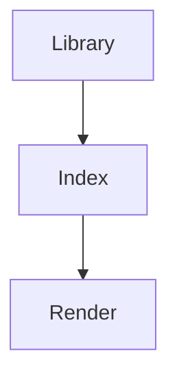

  

# Readme style

> [!NOTE]
> Lectern only reads notes. It never changes them.

> [!WARNING]
> Remote images load over the network.

Every claim here is invented.[^1]

| Version | Highlights | Download size |
| :--- | :---: | ---: |
| 0.3.0 | Faster start | 4.9 MB |
| 0.2.0 | Dark themes | 5.1 MB |
| 0.1.0 | First release | 5.2 MB |

$$
\sum_{i=1}^{n} i = \frac{n(n+1)}{2}
$$

[^1]: Including this footnote.
